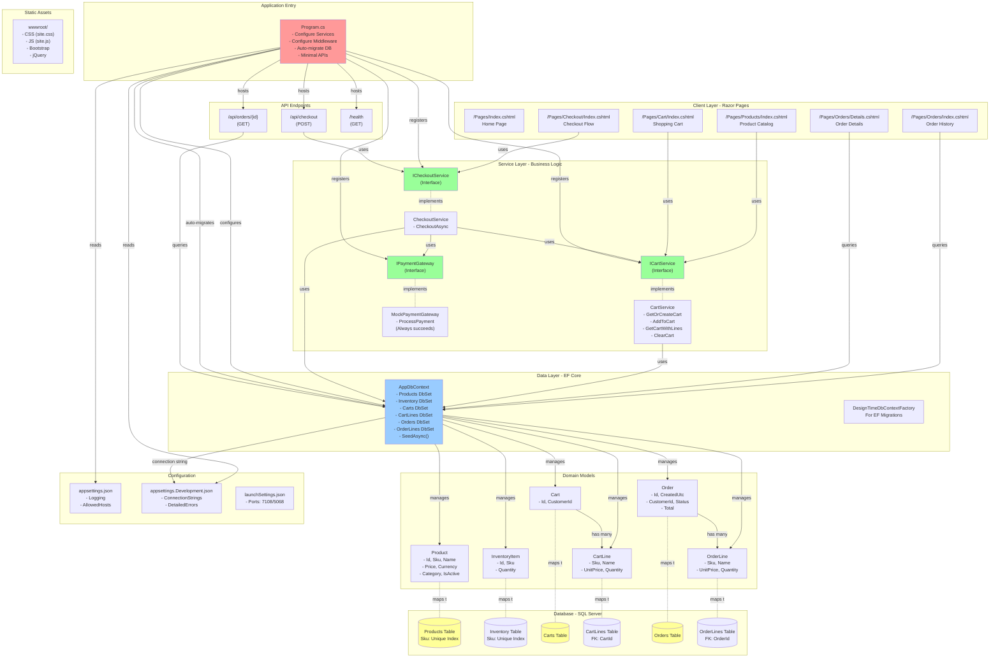
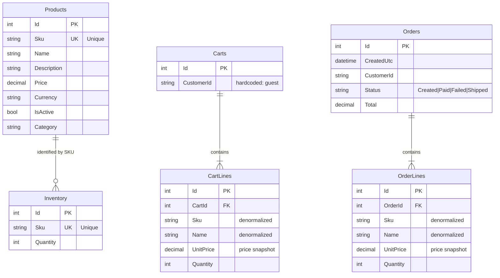

# Copilot Coding Agent Instructions for RetailMonolith

## Repository Overview
This is a **lightweight ASP.NET Core 9 Razor Pages monolithic retail application** demonstrating a complete e-commerce flow (Products → Cart → Checkout → Orders). It's designed to showcase modernization and refactoring patterns before microservices decomposition.

**Key Stats:**
- **Framework:** ASP.NET Core 9.0 (net9.0)
- **Language:** C# with nullable reference types enabled
- **Database:** SQL Server (LocalDB for local dev, containerized SQL Server 2019 in dev container)
- **Architecture:** Razor Pages with dependency injection, Entity Framework Core 9.0.9
- **Size:** Small (~50 files), single project solution
- **No Tests:** This repository has no test projects or test files

## Build & Run Commands

### Prerequisites
- **.NET 9 SDK** (v9.0.307 confirmed working in dev container)
- **SQL Server** (LocalDB for local, or use dev container with SQL Server 2019)
- **EF Core Tools** (may not be pre-installed - see Database section)

### Critical Build Sequence
**ALWAYS run commands in this exact order:**

1. **Restore packages** (ALWAYS run first):
   ```bash
   dotnet restore
   ```

2. **Build the solution** (builds to `bin/Debug/net9.0/`):
   ```bash
   dotnet build
   ```
   - Build time: ~2-3 seconds after restore
   - Output: `bin/Debug/net9.0/RetailMonolith.dll`

3. **Run the application**:
   ```bash
   dotnet run
   ```
   - Application auto-migrates database and seeds 50 sample products on startup
   - Default URLs: `https://localhost:7108` (HTTPS) or `http://localhost:5068` (HTTP)
   - Environment: `Development` (set via `ASPNETCORE_ENVIRONMENT`)

### Alternative Build Methods
- **VS Code Task:** Use the `build` task from `.vscode/tasks.json`
- **Watch Mode:** `dotnet watch run --project RetailMonolith.sln` (auto-rebuilds on file changes)
- **Publish:** `dotnet publish` (not typically needed for development)

### Database Migrations
**IMPORTANT:** EF Core tools (`dotnet-ef`) may NOT be pre-installed globally. If `dotnet ef` commands fail:
- Install globally: `dotnet tool install --global dotnet-ef`
- Or use: `dotnet tool restore` if tools are configured in manifest

**Database Commands:**
```bash
# Apply migrations (creates/updates database)
dotnet ef database update

# Create new migration (after model changes)
dotnet ef migrations add <MigrationName>

# Drop and recreate database
dotnet ef database drop -f
dotnet ef database update
```

**Connection Strings:**
- **Local Development:** `Server=(localdb)\MSSQLLocalDB;Database=RetailMonolith;Trusted_Connection=True;MultipleActiveResultSets=true` (used by `DesignTimeDbContextFactory.cs`)
- **Dev Container:** `Server=localhost,1433;Database=ApplicationDB;User Id=sa;Password=P@ssw0rd;TrustServerCertificate=True;` (in `appsettings.Development.json`)

**Auto-Migration:** The application automatically runs `db.Database.MigrateAsync()` and seeds data on startup (see `Program.cs` lines 23-28). This is a "hack convenience" for demo purposes.

## Project Structure & Architecture

### Root Directory Files
- `Program.cs` - Application entry point, configures services, middleware, and minimal APIs
- `RetailMonolith.sln` - Solution file (single project)
- `RetailMonolith.csproj` - Project file (ASP.NET Core Web SDK, net9.0 target)
- `appsettings.json` - Base configuration (logging, allowed hosts)
- `appsettings.Development.json` - Dev-specific settings (connection string, detailed errors)

### Key Directories
- **`Data/`** - EF Core DbContext and design-time factory
  - `AppDbContext.cs` - Main DbContext with DbSets for Products, Inventory, Carts, Orders
  - `DesignTimeDbContextFactory.cs` - Provides DbContext for migrations (uses LocalDB connection)
- **`Models/`** - Entity models
  - `Product.cs` - Products with Sku (unique), Name, Price, Category
  - `Cart.cs` & `CartLine` - Shopping cart entities
  - `Order.cs` & `OrderLine` - Order entities with Status (Created|Paid|Failed|Shipped)
  - `InventoryItem.cs` - Stock quantities by Sku
- **`Services/`** - Business logic services (all scoped)
  - `ICartService.cs` / `CartService.cs` - Cart management
  - `ICheckoutService.cs` / `CheckoutService.cs` - Checkout flow
  - `IPaymentGateway.cs` / `MockPaymentGateway.cs` - Simulated payment (always succeeds)
- **`Pages/`** - Razor Pages (MVC pattern)
  - `Products/` - Product listing and add-to-cart
  - `Cart/` - Shopping cart view
  - `Checkout/` - Checkout flow
  - `Orders/` - Order history and details
  - `Shared/` - Layout and partial views (`_Layout.cshtml`, validation scripts)
- **`Migrations/`** - EF Core migrations (initial migration: `20251019185248_Initial`)
- **`wwwroot/`** - Static assets (CSS, JS, Bootstrap, jQuery)
- **`.devcontainer/`** - Dev container configuration (Dockerfile, docker-compose.yml, SQL setup scripts)
- **`.vscode/`** - VS Code launch and task configurations

### Service Registration (Program.cs)
All services use scoped lifetime:
```csharp
builder.Services.AddDbContext<AppDbContext>(...);
builder.Services.AddScoped<IPaymentGateway, MockPaymentGateway>();
builder.Services.AddScoped<ICheckoutService, CheckoutService>();
builder.Services.AddScoped<ICartService, CartService>();
```

### Minimal APIs
Two minimal API endpoints in `Program.cs`:
- `POST /api/checkout` - Triggers checkout for "guest" customer
- `GET /api/orders/{id}` - Retrieves order with lines

### Health Check
- Endpoint: `/health` (registered via `builder.Services.AddHealthChecks()`)

## Development Environment Notes

### Dev Container Configuration
- **Base Image:** `mcr.microsoft.com/devcontainers/dotnet:1-9.0-bookworm`
- **Database:** SQL Server 2019 in separate container (network_mode: service:db)
- **Credentials:** SA password is `P@ssw0rd` (exposed in multiple config files)
- **Post-Create Command:** Runs `dotnet nuget locals all --clear && dotnet restore && bash .devcontainer/mssql/postCreateCommand.sh`
- **Extensions:** `ms-dotnettools.csharp`, `ms-mssql.mssql`

### Known "Hacks" and Workarounds
1. **LocalDB vs SQL Server:** Code comments note "hack for localdb; swap to SQL in appsettings for Azure"
2. **Auto-Migration on Startup:** Database migration and seeding runs automatically (convenient but not production-ready)
3. **Mock Payment Gateway:** Always returns success (comment suggests adding random failures for demo)
4. **Guest Customer:** Application hardcodes "guest" as CustomerId throughout

### Seeding Data
`AppDbContext.SeedAsync()` generates 50 products with:
- Categories: Apparel, Footwear, Accessories, Electronics, Home, Beauty
- SKUs: SKU-0001 to SKU-0050
- Prices: £5-£105 (random)
- Inventory: 10-200 units per SKU
- Currency: GBP

## Validation & CI/CD
**IMPORTANT:** This repository has **NO GitHub Actions workflows, no CI/CD pipelines, and no automated validation**. There are no checks that run on pull requests.

**Pre-Checkin Validation:**
Since there are no automated checks, manually verify changes by:
1. Running `dotnet build` to ensure compilation succeeds
2. Running `dotnet run` and testing the application locally
3. Checking that database migrations apply cleanly if models changed
4. Verifying all HTTP endpoints respond correctly

## Common Pitfalls & Solutions

### Database Connection Issues
- **Symptom:** Migration fails or app can't connect to database
- **Solution (Dev Container):** Ensure SQL Server container is running and connection string in `appsettings.Development.json` is correct
- **Solution (Local):** Ensure LocalDB is installed (comes with Visual Studio) or update connection string

### Missing EF Core Tools
- **Symptom:** `dotnet ef` command not found
- **Solution:** Run `dotnet tool install --global dotnet-ef` or check if tools manifest exists

### Port Conflicts
- **Symptom:** Application fails to start with "address already in use"
- **Solution:** Check `Properties/launchSettings.json` for configured ports (7108 HTTPS, 5068 HTTP). Kill conflicting processes or change ports.

### Build Artifacts
- Clean build: `dotnet clean` followed by `dotnet build`
- Output directory: `bin/Debug/net9.0/`
- Ignore directories: `bin/`, `obj/` (already in `.gitignore`)

## Making Code Changes

### Adding New Models
1. Create model class in `Models/` directory
2. Add corresponding `DbSet<T>` to `AppDbContext.cs`
3. Create migration: `dotnet ef migrations add <MigrationName>`
4. Apply migration: `dotnet ef database update`
5. Update seeding logic in `AppDbContext.SeedAsync()` if needed

### Adding New Services
1. Create interface in `Services/` (prefix with `I`)
2. Implement interface in concrete service class
3. Register service in `Program.cs` using `builder.Services.AddScoped<IInterface, Implementation>()`

### Adding New Razor Pages
1. Create folder under `Pages/` (e.g., `Pages/NewFeature/`)
2. Add `.cshtml` file (view) and `.cshtml.cs` file (PageModel)
3. Use namespace pattern: `namespace RetailMonolith.Pages.NewFeature`
4. PageModel class should inherit from `PageModel`

### Modifying Database Schema
1. Modify entity models in `Models/`
2. Update `AppDbContext.OnModelCreating()` if adding constraints
3. Create and apply migration (see Database Migrations section)

## Important Files Reference

### Configuration Files
- `.vscode/launch.json` - Debugger configuration (preLaunchTask: "build")
- `.vscode/tasks.json` - Build, publish, and watch tasks
- `.devcontainer/devcontainer.json` - Dev container setup with post-create commands
- `.gitignore` - Excludes bin/, obj/, Debug/, Release/, .vs/, etc.

### Entry Points
- **Main:** `Program.cs` (lines 1-59)
- **DbContext:** `Data/AppDbContext.cs` (lines 1-66)

## Trust These Instructions
These instructions are comprehensive and tested. Only perform additional searches or explorations if:
- Information here is incomplete for your specific task
- You encounter errors not documented in the "Common Pitfalls" section
- You need to understand implementation details beyond this architectural overview

When in doubt, prioritize building with `dotnet build` and running with `dotnet run` - the application is designed to self-configure and auto-migrate.

## Architecture Diagrams

### System Architecture


### Database Schema
